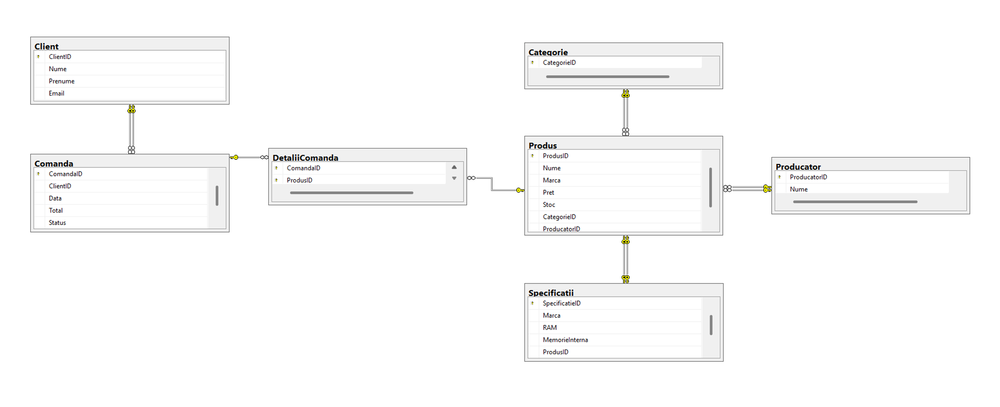
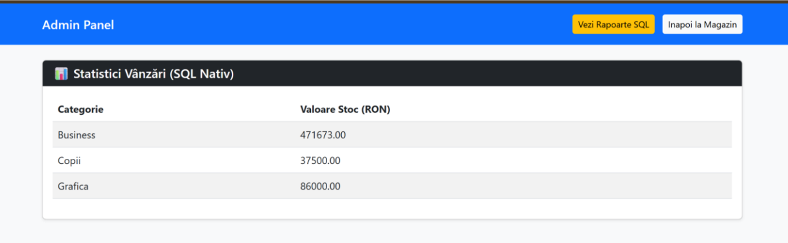
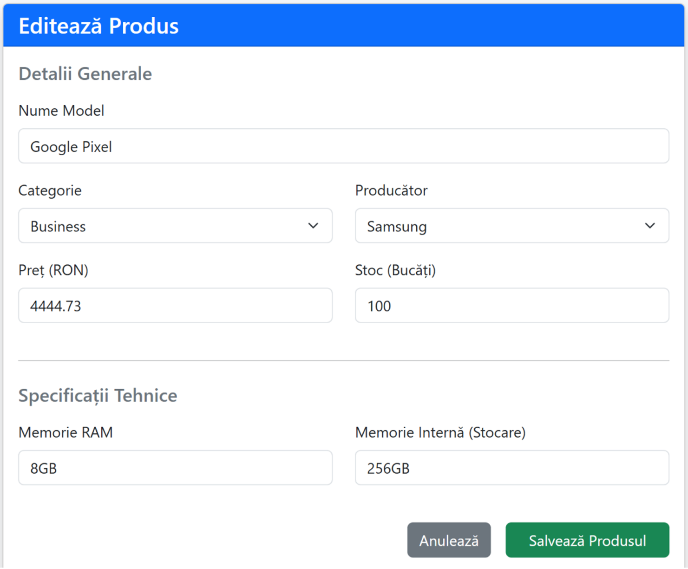

# TechTab - E-Commerce Management System 📱

TechTab este o aplicație web Full-Stack bazată pe arhitectura MVC, dezvoltată pentru gestionarea inventarului, a vânzărilor și a bazei de date pentru un magazin online de tablete.

Proiectul gestionează baza de date a magazinului, asigurând persistența și integritatea datelor, cu un focus puternic pe scrierea de interogări SQL native complexe.

## 🛠️ Tehnologii Folosite
* **Backend:** Java, Spring Boot, Spring Data JPA, Hibernate
* **Bază de Date:** Microsoft SQL Server (T-SQL)
* **Frontend:** HTML5, CSS3, Bootstrap 5, Thymeleaf (Server-side rendering)

## ✨ Funcționalități Principale
* **Gestiune Produse (CRUD):** Administrarea tabelelor de bază (Produse, Categorii, Producători, Clienți).
* **Procesare Comenzi (Activity Flow):** Monitorizarea și modificarea stării comenzilor printr-un flux definit (New -> Processing -> Shipped -> Completed).
* **Rapoarte Analitice (Native SQL):** Implementarea a 10 interogări SQL complexe (JOIN-uri, GROUP BY, Subcereri) pentru generarea statisticilor, ocolind parțial ORM-ul pentru performanță.
* **Integritatea Datelor:** Asigurarea consistenței prin chei străine (FK), unicitate (Unique) și validare la nivel de câmp (ex: prețuri pozitive).

## 🗄️ Arhitectura Bazei de Date
Baza de date a fost normalizată până la **Forma Normală 3 (3NF)**.
* Tabela centrală este `Produs`.
* Relație **1-la-1** cu tabela `Specificatii` pentru a evita valorile NULL.
* Relație **Many-to-Many** între `Comanda` și `Produs`, gestionată prin tabela `DetaliiComanda`.

## 💻 Interfața Grafică (GUI)

### 1. Dashboard Administrativ & Statistici SQL
Afișează în timp real rezultatul interogării cu `GROUP BY` (statistici stoc) și permite modificarea statusului comenzilor printr-un UPDATE atomic.

### 2. Formular Gestiune (Relații Multiple)
Permite manipularea simultană a datelor în tabelele `Produs` și `Specificatii` (inserare/editare), menținând legăturile de chei străine.

## 🚀 Instalare și Rulare
1. Rulează scriptul `proiect_bd.sql` în SQL Server Management Studio (SSMS) pentru a genera structura și datele de test.
2. Clonează repository-ul și deschide-l în IntelliJ IDEA.
3. Configurează datele de conectare la baza de date în `application.properties`.
4. Rulează aplicația și accesează `http://localhost:8080/admin`.
